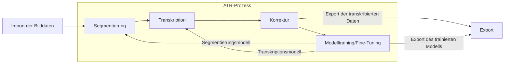

# Handschriften transkribieren mit eScriptorium

DH Lab 
22. Januar 2025

---

# Was ist ATR?

- Automated Text Recognition (ATR) = Handwritten Text Recognition (HTR) + Optical Character Recognition (OCR)
- Automatisierte Erkennung von Text in Bilddaten
- Es gibt verschiedene "Engines", die unterschiedlich funktionieren
- Moderne Systeme verwenden trainierte Modelle auf der Basis neuronaler Netzwerke
- Fester Bestandteil von Digitalisierungsworkflows in Bibliotheken und bei der Erforschung von z.B. Manuscripten und Briefen

---

# Was ist eScriptorium?

- seit 2018 als Teil des Scripta-Projekts an der Université PSL entwickelt
- gefördert von zahlreichen weiteren Projekten und Stiftungen, u.a. Biblissima, OpenITI und Mellon Foundation
- umfasst eine Web-App, die auf einem kraken-core aufgesetzt ist
- Ziel ist: "[to] provide researchers in the humanities with an integrated set of tools to transcribe, annotate, translate and publish historical documents" (GitLab) &rarr; Endnutzer:innentauglichkeit

---

# Was gibt es sonst noch? - Transcribus

- Vorteile: 
  - Einfache und kostenlose Web-App
  - Große Menge vortrainierter Modelle verschiedener Qualitäten und für zahlreiche Schriften
  - Großes Team erlaubt state of the art im Bereich ATR
- Nachteile:
  - Proprietäre Lizenz
  - Beschränkte Möglichkeiten des Modellexports
  - Kostenpflichtiges Credit-System bei größeren Datenmengen

---

# Was gibt es sonst noch? - OCR4all

- Vorteile:
  - Einfache und kostenlose Web-App, in der ab Version 2 modulare Pipelines möglich werden sollen
  - OpenSource und frei nutzbar
- Nachteile:
  - Wir warten immer noch auf Version 2 &colon;-)
  - Installation braucht bei Version 1 noch ein gewisses Know-How
  - UI von Version 1 ist gewöhnungsbedürftig

---

# Warum also eScriptorium?

eScriptorium bietet:
- eine offene Plattform für Modellimport und -export
- ein einfaches User-Interface
- eine große Community of Practice
- andauernde Open Source Entwicklung
- kostenlose Nutzung
- gute Nutzbarkeit auch bei nicht-lateinischen Schriften

---

# Grundlegender Workflow

---
layout: center
---

## Demonstration: Wie funktioniert der Workflow?

---

# Hand's On

1. Gehen Sie auf https://escriptorium.sub.uni-hamburg.de
2. Loggen Sie sich zunächst via <strong>dayofocr</strong>/<strong>dhlab20250122</strong> ein, um auf eScriptorium zugreifen zu können
3. Loggen Sie sich bei eScriptorium mit den Zugangsdaten <strong>workshop_$n</strong>/<strong>hands-on!</strong> ein
 
 
## Aufgabe 1: Erstellen Sie ein Projekt

---

# Hand's On
Jetzt arbeiten Sie!

Falls Sie keine eigenen Daten haben, besuchen Sie die folgenden URLs:

- https://resolver.sub.uni-hamburg.de/kitodo/HANSb336028
- https://resolver.sub.uni-hamburg.de/kitodo/HANSb336015
- https://resolver.sub.uni-hamburg.de/kitodo/HANSb336024

Für weitere Modelle zu anderen Schriften:

- https://htr-united.github.io/catalog.html
- https://zenodo.org/communities/ocr_models

## Aufgabe 2: Laden Sie Bilddaten in Ihr Projekt und gehen Sie die einzelnen Arbeitsschritte durch.

---
layout: center
---

## Demonstration: Modelltraining

---
layout: center
---

## Demonstration: Export

---
layout: center
---

# Fragen? Antworten?

forschungsdienste@sub.uni-hamburg.de

