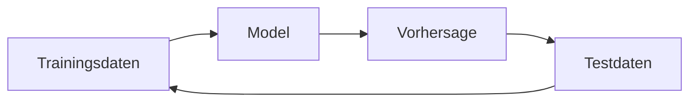

# KI Kolloquium

Entwicklung von AI Literacy

---

# Maschinelles Lernen

- Überwachtes Lernen (Supervised Learning)
  - Regression (Regression)
    - Gibt eine numerische Aussage
  - Klassifikation (Classification)
    - Kategorisierende Aussage
- Nicht-überwachtes Lernen (Unsupervised Learning)
  - Erkennen von Mustern (z.B. Clustering)
- Verstärkendes Lernen (Reinforcement Learning)
  - Bestmögliches Verhalten entwickeln (z.B. Robotik)
- Generative KI
  - Inhalte aus Eingaben generieren

---

# Wie "lernt" die Maschine?

Trainingsdatensatz:

| Größe | Monatliche Kaltmiete |
| --- | --- |
| 40m2 | 430,00 |
| 105m2 | 1200,00 |
| 80m2 | 1010,00 |
| 84m2 | 800,00 |
| 87m2 | 920,00 |
| 30m2 | 400,00 |
| 120m2 | 1530,00 |
| 20m2 | 380,00 |

---

# Training
 
Wir können mit dem bekannten Modell berechnen, wie der wahrscheinliche Mietpreis einer Wohnung mit 75m2 ist. Testen wir das gegen einen Testdatensatz mit verifizierten Daten und können bestätigten, dass die Information korrekt ist oder mit geringer Abweichung (= Loss) zum tatsächlichen Wert, können wir die Information zum Modell dazugeben (= Training).

Fügt man dem Datensatz mit Blick auf ein bestimmtes Ziel verfizierte Daten (z.B. weitere Parameter) hinzu, spricht man von "fine-tuning".

Generell gilt: Je größer und diverser ein Datensatz ist, desto wahrscheinlicher treffen die Vorhersagen zu.

Man nennt dieses System auch ein künstliches neuronales Netz.

--- 

# Künstliche Neurale Netze

<ol>
  <li>Daten werden eingegeben</li>
  <li>Beliebig viele "versteckte" Schichten gewichten immer neu die Ergebnisse des vorhergehenden Knotens</li>
  <li>Final gewichtetes Ergebnis wird ausgegeben</li>
</ol>

Die verborgene Schicht heißt auch "Black Box", da Prozesse hier nicht im Einzelnen nachvollziehbar sind.

---

# Generative KI

- Generative KI ermittelt die auf einem Sprachmodell basierende Warhscheinlichkeit für das Vorkommen eines bestimmten Tokens (= Wort, Wortteil)
- Sprachmodelle enthalten angereichte Wort- und Satzbausteine 
- Durch das Training mit natürlicher Sprache suggeriert generative KI, z.B. ein menschlicher Gesprächspartner zu sein
- Large Language Models (LLM) sind sehr umfangreiche Modelle, die suggerierte Gesprächssituation ermöglichen

---

# Das große "ABER"

Das heißt, dass das Model/die Maschine nur auf der Basis dessen Vorhersagen treffen kann, was Menschen dem Modell vorher gefüttert haben.

## Computer sind sehr dumm.

=> "KI" ist nicht intelligent.

---

# Vor- und Nachteile von GKI

## Vorteile

- Neue Lösungen für Assistenzsysteme
- Interfaces (z.B. bei Suchen) sind mit natürlicher Sprache möglich
- Unterstützung bei kreativem Arbeiten (kreatives Schreiben, Coding, ...)
- Niedrigschwelligere Einstiege in kreative Tätigkeiten
- Internationalisierung ist deutlich einfacher geworden

## Nachteile

... zuviele für eine gemeinsame Folie. 

--- 

# Nachteile

- Große Sprachmodelle erfordern enorme Rechenleistung (ökologischer Impact)
- LLM werden häufig auf Inhalten des Webs trainiert &rarr; Fake und Falschinformationen in Trainingsdaten
- Human Supervision und Training oft in Ausbeutungsverhältnissen in Niedriglohnländern
- Black Box: Technologie ist so kompliziert, das oft nicht klar ist, wie bestimmte Ergebnisse zustandegekommen sind
- LLM lernen zunehmend auf LLM-Inhalten
- Marktmacht großer Konzerne (Meta, Google, X)
- Massive Herausforderungen im Bereich des Daten- und Urheberrechtsschutzes (technisch wie rechtlich)
- Bias, "Halluzinationen", Fake News, Bildfälschungen, Propaganda
- Je nach Einsatzgebiet massive Diskriminierungen (z.B. Face Recognition bei POC)
- Herausforderungen für klassisch-wissenschaftliche Produktionsmittel (Abschlussarbeiten, Publikationen)
- Herausforderungen für Kultur-, Musik und Kunstbetrieb durch KI-generierte Produkte
- Low-Resourced Languages sind nach wie vor unterrepräsentiert &rarr; Marginalisierung wird weiter gefördert

---

# Erneut ein ABER:

- Machine Learning ist jenseits von GKI ein nicht wegzudenkender Teil digitaler Infrastruktur:
  - Druck- und Handschriftenerkennung
  - Natural Language Processing
  - Fuzzy-Suchen
- Es gibt zunehmend Versuche, bestimmte Nachteile zu kontern:
  - Nachhaltige LLM ohne Diskriminative und Bias
  - Klimaneutrale Rechenzentren gegen den ökologischen Impact
  - Alternativen zu Big Tech LLMs
- Für die Wissenschaft ist ein Überdenken des klassischen Publikationsmodus unter Umständen gar nicht das schlechteste...

---

# Was heißt das denn nun?

1. Der GKI-Hype ist gefährlich und GKI nicht eigentlich nachhaltig
2. Die Übernahme von GKI in sensible Infrastrukturbereiche kann ein großes Problem sein
3. GKI ist massiv für die Entstehung von Fakes und Falschinformationen mitverantwortlich
4. Eine kritische Nutzung von GKI in nicht-sensiblen Bereichen kann eine echte Erleichterung für Nutzer:innen sein
5. Wenn Sie Angst vorm weißen Blatt haben ist Ihnen niemand bös, wenn Sie die GKI den Anfang machen lassen

UND: GKI stellt trotz AI Act gerade Institutionen wie Bibliothek vor enorme Herausforderungen durch:
1. Ungewolltes Scraping (=Abgreifen) der Bestände für LLM-Trainings
2. GKI-generierte Literaturverzeichnisse mit nicht-existierenden Publikationen
3. Enormes Ungleichgewicht zwischen technischen Möglichkeiten und rechtlichen Risiken bei GKI

---

# Sie sehen: Es ist kompliziert.

Deshalb gibt es jetzt:

## Das KI-Kolloquium ...

... in dem wir alle zu KI-Expert:innen werden!

